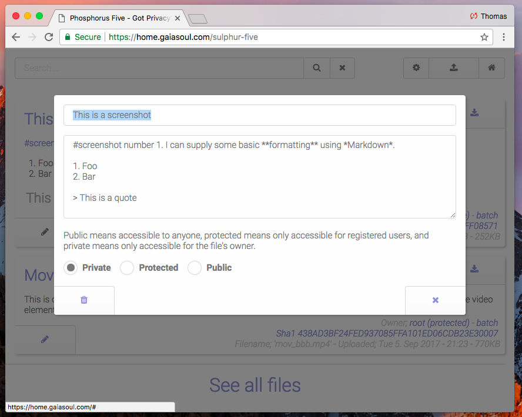

# Sulphur Five - Secure file sharing for everyone

Sulphur Five is an Open Source file sharing module for [Phosphorus Five](https://github.com/polterguy/phosphorusfive), that allows you
to cryptographically secured share files with your friends, family, and colleagues. When you upload a file, you can choose to either mark it
as _"private"_, _"protected"_ or _"public"_. A private file is only accessible for yourself. A protected file can be accessed by all other
users in the system. A public file is accessible for everyone, including randomly visiting guests.

## Hashtagging your files

Often it can be difficult to categorise a file into a single folder. Therefor we have completely eliminated that problem, by putting all
your files into a single virtual folder, and rather allow you to #hashtag your files as you see fit. This allows you to put a single file into
multiple categories, according to its relevance, by simply #tagging your file, as you provide a description for it.

If you see the video file that is shared in the above screenshot for instance, it is hashtagged with three different tags.

* #video
* #CC - Implying Commons Creative
* #free

This allows you to more easily find your files later, by searching for a file, according to its tag, instead of having to browse through multiple folders.

## Describe your files with Markdown

In addition, as you upload files, you can (optionally) provide a description, and a friendly name for your file, indicating what the file's content is.
This allows multiple users to more easily collaborate with each other, sharing files back and forth between each other, while more easily find the files
they're looking for. There is also a search interface, allowing you to easily search for files, according to username, name, description, or tag(s).

## Security, security and security!

Sulphur Five is built with security in mind from day 1. Among other things, when you upload a file, a SHA1 value is generated from
the file's content, and associated with the file. This allows you to cryptographically verify that as you download a file, you're actually getting the
file you requested, and not some bogus file, served by a malicious man in the middle.

This also happens to facilitate for extreme mirroring of files, where if a file for some reasons, is lost in one server, you can still search for its
SHA1 value in other servers, and possibly find your file - If it has been shared by other instances that is. This allows you to massively distributed
share the same file, on literally thousands of different servers, yet still have a cryptographic guarantee of that it is the exact same file, and that 
it has not been tampered with in any ways!

When the system converts the specified Markdown into HTML, it will even _"whitewash"_ the resulting HTML tag result, and only display what is considered
to be safe HTML tags. And if a user provides a hyperlink, to another website, which somehow describes the file, the system will automatically create
a _"rel='noreferrer'"_ attribute to your links - Which does not pass in the referring website to the hyperlink's endpoint, making it impossible
for the other side, to know who served the hyperlink.

There are literally a _"gazillion"_ tiny features like the above describes, to ensure your privacy, in all regards, as you are sharing your files.

## User interface

Uploading a file, is as simple as dragging and dropping it unto the surface of your browser. Alternatively, clicking a button. Sulphur supports
uploading as many files as you wish at the same time, and each file can be ~2GB in size. The uploading process, and downloading process, is 
extremely secure, and will validate that the user has access to upload/download the specific file. If a file exists on the server from before,
it will be rejected. This is done by creating a SHA1 checksum of the uploaded file, and check if another file with the same SHA1 checksum exists
from before.

By default, the system will only show the first 10 matches, according to your search criteria, or the global list of files you have access to. As
you scroll to the bottom of your page though, it will automatically _"feed"_ you more files, kind of the same way Twitter keeps on feeding you results,
until there are no more results matching your criteria.

## WikiLeaks dropbox

The system can also be configured to act as a _"WikiLeaks dropbox"_, allowing for anonymous guests to upload files to your server. Although most people
would probably not want this, some few might want such features. Potential candidates for setting up the system into such a modus operandi, might be
media houses, magazines, news providers, etc. Combined with teaching your users to use the [Tor Browser](https://www.torproject.org/projects/torbrowser.html.en), 
this allows you to anonymously accept files, tips and such from sources, whom you wouldn't even know yourself who are.
